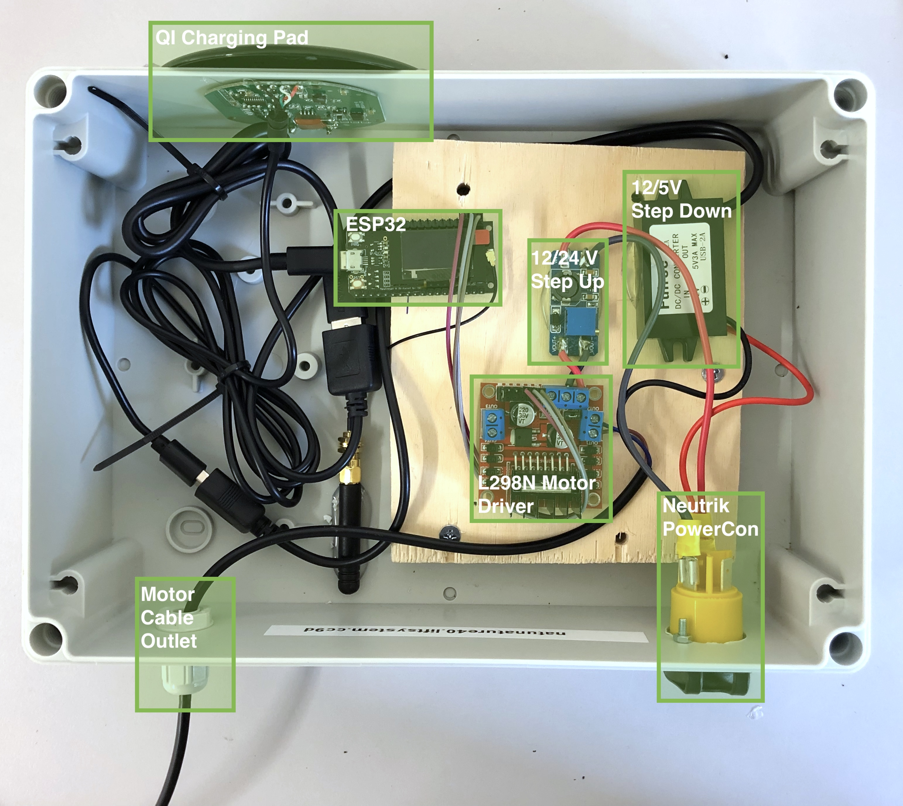
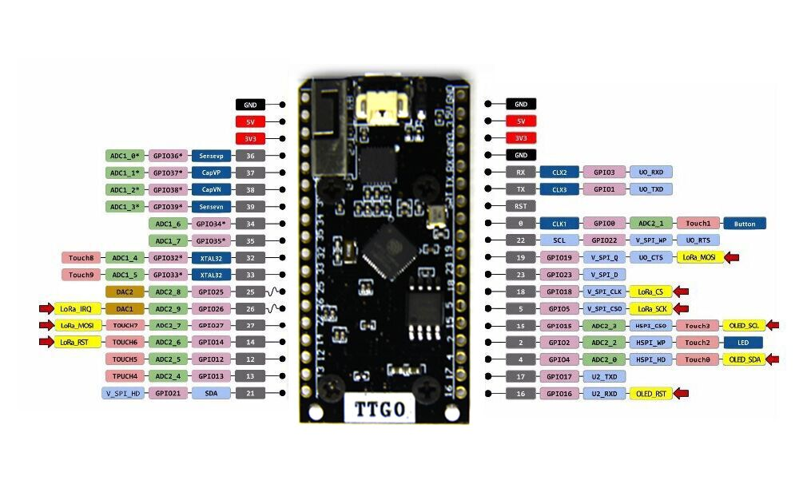

# Nature 4.0: LiftSystem Satellite

[](https://travis-ci.org/Nature40/Satellite-LiftSystem)

The LiftControl Satellite has one job: offering an API via WiFi to control the motor for the lift, connected via an L298N motor control unit.


## Motor Control Protocol (UDP port 35037)
 
The Motor Control Protocol (MCP) is a lightweight UDP-based protocol to enable the motor to be controlled via WiFi. A timeout needs to be configured on initializing the software.

The UDP payload consists of an ASCII-encoded command from this list:

```
speed [-255, 255] : sets the motor the given speed
timeout <ms>      : sets internal timeout for issued commands (default: 500 ms)
``` 

When a command is received, the ESP runs the motor until a the timeout happens. New speed command overwrite old speed commands and also restart the timeout.

### Minimal client

A minimal client in bash could look like this:
```bash
while true; do
    echo "speed 255"
    sleep 0.05
done | nc -u 192.168.3.254 35037
```

One line:
```bash
while true; do echo "speed 255"; sleep 0.05; done | nc -u 192.168.3.254 35037
```

## Box Assembly

The final box consists of:

 - Neutrik PowerCon (power in)
 - 12V -> 24V step up
 - L298N motor driver
 - 12V -> 5V step down
 - TTGO LoRa (or other ESP32-based board)
 - 2 Buttons (manual up/down control)
 - QI Charging Pad
 - Motor Connection Cable (out)



### TTGO LoRa / ESP32 connections

```
#define EN_A 21
#define IN1 13
#define IN2 12

#define BUTTON_DOWN 32
#define BUTTON_UP 33
```

### ESP32: TTGO LoRa



### L298N 


The each motor is controlled through three logical pins:

 - ENABLE: PWM signal for duty cycle
 - INPUT 1: digital signal forwards
 - INPUT 2: digital signal backwards

## References

- [How to Use L298N Motor Driver](https://www.teachmemicro.com/use-l298n-motor-driver/)
