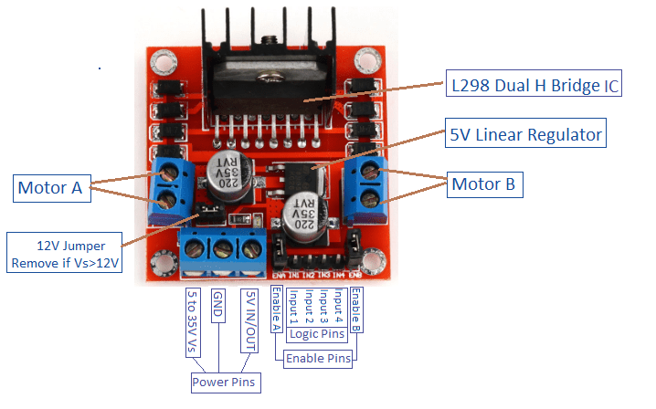

# Nature 4.0: LiftSystem Satellite

The LiftControl Satellite has one job: offering an API via WiFi to control the motor for the lift, connected via an L298N motor control unit.

## ESP32: TTGO LoRa

## L298N 

The each motor is controlled through three logical pins:

 - ENABLE: PWM signal for duty cycle
 - INPUT 1: digital signal forwards
 - INPUT 2: digital signal backwards

## Motor Control Protocol (UDP port 35037)
 
The Motor Control Protocol (MCP) is a lightweight UDP-based protocol to enable the motor to be controlled via WiFi. A timeout needs to be configured on initializing the software.

The UDP payload consists of an ASCII-encoded number in the range of [-255, 255]. 

When a command is received, the ESP runs the motor until a preconfigured timeout happens (usually <1s). When a command is received before the timeout happens, the new command is taken and the timeout is resetted.

## Box Assembly

## References

- [How to Use L298N Motor Driver](https://www.teachmemicro.com/use-l298n-motor-driver/)
